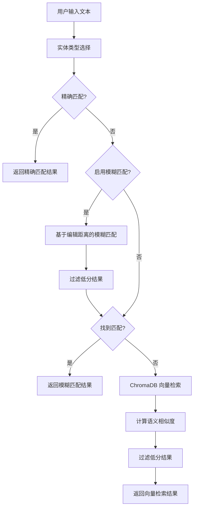
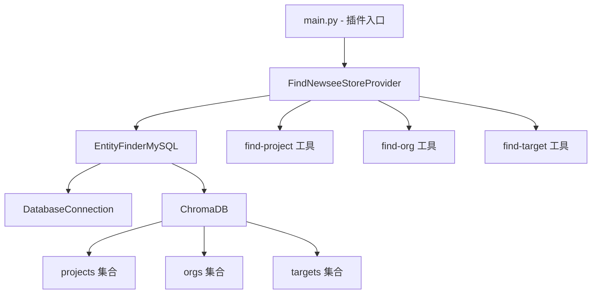

# Newsee 实体查找插件

**Author:** delldi
**Version:** 0.3.0
**Type:** tool
**License:** MIT

## ✨ 功能特点

- **多级匹配策略**：
  - 精确匹配：直接识别文本中的实体名称
  - 模糊匹配：基于编辑距离的模糊匹配，处理拼写错误
  - 向量检索：使用 Sentence-BERT 进行语义搜索
- **多实体类型**：支持项目(project)、组织(org)和指标(target)三种实体类型
- **数据库集成**：直接从 MySQL 数据库加载和更新实体数据
- **可配置**：灵活的阈值和开关配置
- **多语言支持**：基于多语言模型，支持中英文实体识别

## 🏗️ 技术架构



### 系统组件



### 核心模块

- **`provider/entity_finder_mysql.py`**: 实体查找器核心实现
  - `EntityFinderMySQL` 类：管理实体识别全流程
  - 支持多种匹配策略和结果合并
  - 提供数据库集成和向量检索功能
- **`provider/database.py`**: 数据库连接管理
  - `DatabaseConnection` 类：处理数据库连接和查询
  - 基于 SQLAlchemy 和 PyMySQL 实现
- **`main.py`**: 插件入口点
- **`provider/find-newsee-store.py`**: Dify 插件提供者实现
- **`tools/`**: 工具实现目录
  - `find-project.py`: 项目查找工具
  - `find-org.py`: 组织查找工具
  - `find-target.py`: 指标查找工具

## 🚀 快速开始

### 1. 安装依赖

```bash
# 安装依赖
uv pip install -r requirements.txt
```

### 2. 配置数据库

创建数据库（如果不存在）：

```sql
CREATE DATABASE IF NOT EXISTS `newsee-view`
    CHARACTER SET utf8mb4
    COLLATE utf8mb4_unicode_ci;
```

### 3. 运行示例

```python
import asyncio
from provider.entity_finder_mysql import EntityFinderMySQL

async def main():
    # 配置数据库连接
    db_config = {
        "host": "localhost",
        "port": 3306,
        "user": "your_username",
        "password": "your_password",
        "database": "newsee-view"
    }

    # 初始化查找器
    finder = EntityFinderMySQL()
    await finder.initialize(db_config)

    # 查找实体
    results = finder.search("星河湾", entity_type="project", top_k=3)
    print(results)

    # 查找组织
    results = finder.search("龙游", entity_type="org", top_k=3)
    print(results)

    # 查找指标
    results = finder.search("旧欠", entity_type="target", top_k=3)
    print(results)

if __name__ == "__main__":
    asyncio.run(main())
```

## ⚙️ 配置选项

可以在 `provider/entity_finder_mysql.py` 中修改默认配置：

```python
DEFAULT_CONFIG = {
    "fuzzy_match_threshold": 0.8,  # 模糊匹配阈值 (0-1)
    "vector_search_threshold": 0.6,  # 向量搜索阈值 (0-1)
    "top_k": 3,  # 默认返回结果数量
    "enable_fuzzy": True,  # 是否启用模糊匹配
    "enable_vector_search": True,  # 是否启用向量搜索
}
```

## 📊 数据格式

### 项目数据格式

```python
{
    "id": "P001",  # 项目ID
    "name": "星河湾",  # 项目名称
}
```

### 组织数据格式

```python
{
    "id": "O001",  # 组织ID
    "name": "星河湾1号楼",  # 组织名称
}
```

### 指标数据格式

```python
{
    "id": "T001",  # 指标ID
    "name": "旧欠",  # 指标名称
    "unit": "元",  # 指标单位
}
```

## 🛠️ 开发指南

### 添加新功能

1. 在 `provider/entity_finder_mysql.py` 中扩展 `EntityFinderMySQL` 类
2. 更新数据库查询和向量存储逻辑
3. 添加单元测试

### 添加新实体类型

1. 在 `entity_finder_mysql.py` 中的 `_load_entities` 方法添加新的实体类型查询
2. 在 `collections` 字典中添加新的集合
3. 创建对应的工具实现文件

### 测试

```bash
# 运行测试脚本
python -m tests.test_plugin
```

## 📝 使用示例

### 在 Dify 平台中调用

#### 查找项目

```
查询示例: "星河湾"

响应:
{
  "success": true,
  "query": "星河湾",
  "entities": [
    {
      "id": "P001",
      "name": "星河湾",
      "type": "project",
      "confidence": 0.95,
      "match_type": "vector"
    }
  ],
  "message": "找到 1 个匹配实体"
}
```

#### 查找组织

```
查询示例: "龙游"

响应:
{
  "success": true,
  "query": "龙游",
  "entities": [
    {
      "id": "O001",
      "name": "龙游公司",
      "type": "org",
      "confidence": 0.92,
      "match_type": "vector"
    }
  ],
  "message": "找到 1 个匹配实体"
}
```

#### 查找指标

```
查询示例: "旧欠"

响应:
{
  "success": true,
  "query": "旧欠",
  "entities": [
    {
      "id": "T001",
      "name": "旧欠",
      "type": "target",
      "confidence": 1.0,
      "match_type": "exact"
    }
  ],
  "message": "找到 1 个匹配实体"
}
```

### 响应字段说明

| 字段名 | 类型 | 说明 |
|--------|------|------|
| success | boolean | 请求是否成功 |
| query | string | 原始查询文本 |
| entities | array | 匹配到的实体列表 |
| - id | string | 实体ID |
| - name | string | 实体名称 |
| - type | string | 实体类型 (project/org/target) |
| - confidence | float | 置信度 (0-1) |
| - match_type | string | 匹配类型 (exact/fuzzy/vector) |
| message | string | 处理结果消息 |
```
