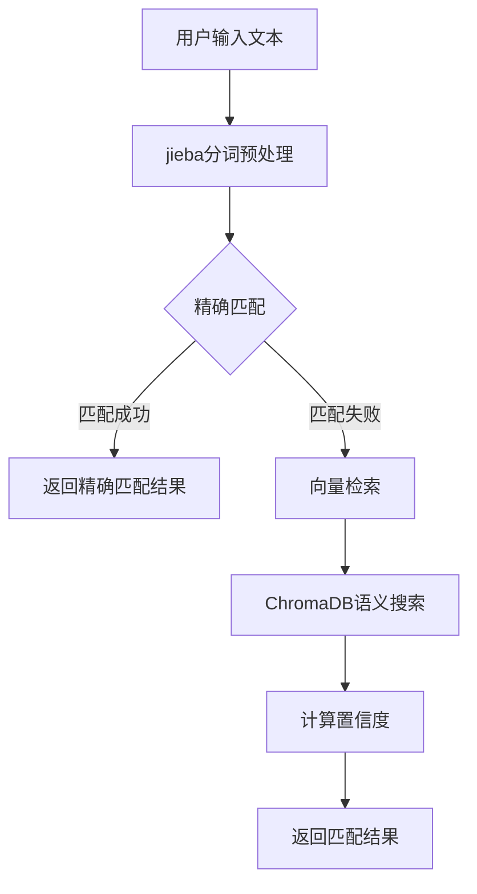

# Newsee Entity Finder 插件

**Author:** delldi
**Version:** 0.1.0
**Type:** tool

## 功能介绍

该插件用于从用户输入的文本中识别并提取项目和房产实体，并返回对应的ID和相关信息。主要功能：

- 精确匹配：直接识别文本中出现的项目和房产名称
- 模糊匹配：使用向量检索找到语义相似的实体
- 返回结果包含实体ID、名称、置信度和匹配类型

## 技术实现

该插件采用混合检索策略：



### 主要模块

- **entity_finder.py**: 实体查找器核心实现，包含精确匹配和向量检索
- **main.py**: 插件入口点，负责初始化环境
- **find-newsee-store.py (工具)**: 处理工具调用和响应格式化

## 安装与配置

### 依赖安装

```bash
pip install -r requirements.txt
```

### 运行插件

```bash
python -m main
```

## 数据配置

当前插件使用内置示例数据。在实际生产环境中，您需要编写数据同步逻辑，将企业数据库中的项目和房产信息同步到插件的向量数据库。

### 数据同步示例

```python
from provider.entity_finder import EntityFinder

# 假设这些数据从企业数据库中获取
projects = [
    {"id": "P100", "name": "新项目", "location": "某地区"}
]
properties = [
    {"id": "R100", "name": "新房产", "project_id": "P100", "rooms": 2}
]

entity_finder = EntityFinder()
project_count, property_count = entity_finder.sync_data(projects, properties)
print(f"已同步 {project_count} 个项目和 {property_count} 个房产数据")
```

## 使用示例

在Dify平台中调用此插件：

```
查询示例: "北京星河湾的房产信息"

响应:
{
  "success": true,
  "query": "北京星河湾的房产信息",
  "entities": [
    {
      "id": "P001",
      "name": "星河湾项目",
      "type": "project",
      "confidence": 0.95,
      "match_type": "vector"
    },
    {
      "id": "R001",
      "name": "星河湾1号楼",
      "type": "property",
      "confidence": 0.89,
      "match_type": "vector"
    }
  ],
  "message": "找到 2 个匹配实体"
}
```
