# Newsee 实体查找插件

**Author:** delldi  
**Version:** 0.2.0  
**Type:** tool  
**License:** MIT

## ✨ 功能特点

- **多级匹配策略**：
  - 精确匹配：直接识别文本中的实体名称
  - 模糊匹配：基于编辑距离的模糊匹配，处理拼写错误
  - 向量检索：使用 Sentence-BERT 进行语义搜索
- **动态数据加载**：支持运行时更新实体数据
- **可配置**：灵活的阈值和开关配置
- **多语言支持**：支持中英文实体识别

## 🏗️ 技术架构

```mermaid
graph TD
    A[用户输入文本] --> B[jieba 中文分词]
    B --> C{精确匹配?}
    C -->|是| D[返回精确匹配结果]
    C -->|否| E{启用模糊匹配?}
    E -->|是| F[基于编辑距离的模糊匹配]
    F --> G[过滤低分结果]
    G --> H{找到匹配?}
    E -->|否| H
    H -->|是| I[返回模糊匹配结果]
    H -->|否| J[ChromaDB 向量检索]
    J --> K[计算语义相似度]
    K --> L[过滤低分结果]
    L --> M[返回向量检索结果]
```



### 核心模块

- **`entity_finder.py`**: 实体查找器核心实现
  - `EntityFinder` 类：管理实体识别全流程
  - 支持多种匹配策略和结果合并
  - 提供数据同步接口
- **`data/sample_data.py`**: 示例数据和配置
  - 默认项目和房产数据
  - 停用词列表
  - 默认参数配置
- **`main.py`**: 插件入口点
- **`find-newsee-store.py`**: Dify 工具实现

## 🚀 快速开始

### 1. 安装依赖

```bash
# 安装依赖
uv pip install -r requirements.txt
```

### 2. 运行示例

```python
from provider.entity_finder import EntityFinder

# 初始化查找器
finder = EntityFinder()

# 查找实体
results = finder.find_entities("我想了解星河湾的房产信息")
print(results)

# 动态更新数据
new_projects = [{"id": "P100", "name": "新项目", "location": "北京海淀区"}]
new_properties = [{"id": "R100", "name": "新楼盘1栋", "project_id": "P100", "rooms": 3}]
finder.sync_data(projects=new_projects, properties=new_properties)
```

## ⚙️ 配置选项

可以在 `provider/data/sample_data.py` 中修改默认配置：

```python
DEFAULT_CONFIG = {
    "fuzzy_match_threshold": 0.8,  # 模糊匹配阈值 (0-1)
    "vector_search_threshold": 0.6,  # 向量搜索阈值 (0-1)
    "top_k": 3,  # 默认返回结果数量
    "enable_fuzzy": True,  # 是否启用模糊匹配
    "enable_vector_search": True,  # 是否启用向量搜索
}
```

## 📊 数据格式

### 项目数据格式

```python
{
    "id": "P001",  # 项目ID
    "name": "星河湾",  # 项目名称
    "location": "北京朝阳区"  # 项目位置
}
```

### 房产数据格式

```python
{
    "id": "R001",  # 房产ID
    "name": "星河湾1号楼",  # 房产名称
    "project_id": "P001",  # 所属项目ID
    "rooms": 3  # 房间数
}
```

## 🛠️ 开发指南

### 添加新功能

1. 在 `entity_finder.py` 中扩展 `EntityFinder` 类
2. 更新 `sample_data.py` 中的配置或数据
3. 添加单元测试

### 测试

```bash
# 运行单元测试
pytest tests/
```

## 📝 使用示例

### 在 Dify 平台中调用

```
查询示例: "北京星河湾的房产信息"

响应:
{
  "success": true,
  "query": "北京星河湾的房产信息",
  "entities": [
    {
      "id": "P001",
      "name": "星河湾",
      "type": "project",
      "confidence": 0.95,
      "match_type": "vector"
    },
    {
      "id": "R001",
      "name": "星河湾1号楼",
      "type": "property",
      "confidence": 0.89,
      "match_type": "vector"
    }
  ],
  "message": "找到 2 个匹配实体"
}
```

### 响应字段说明

| 字段名 | 类型 | 说明 |
|--------|------|------|
| success | boolean | 请求是否成功 |
| query | string | 原始查询文本 |
| entities | array | 匹配到的实体列表 |
| - id | string | 实体ID |
| - name | string | 实体名称 |
| - type | string | 实体类型 (project/property) |
| - confidence | float | 置信度 (0-1) |
| - match_type | string | 匹配类型 (exact/fuzzy/vector) |
| message | string | 处理结果消息 |
```
